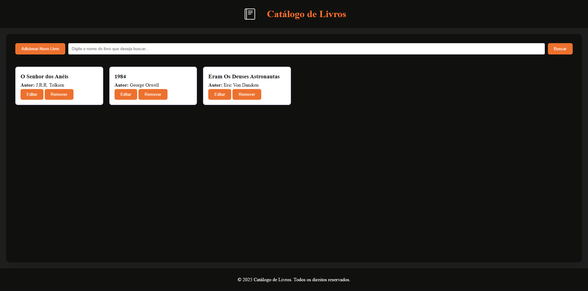
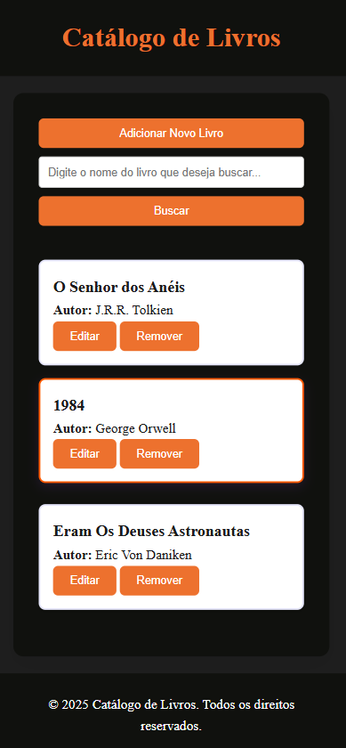

# Frontend do Projeto de Gestão de Livros

Este é o frontend do sistema de **gerenciamento de livros**, permitindo que usuários **cadastrem, editem, excluam e pesquisem livros** de forma interativa.

## Tecnologias Utilizadas
- HTML5
- CSS3 
- JavaScript (ES6+)
- Fetch API para integração com backend

---

## 🔧 Instalação e Configuração

### 1️⃣ **Clone o repositório**
```sh
git clone https://github.com/seu-repositorio.git
cd frontend
```


Result Project Desktop:



Result Project Mobile:

